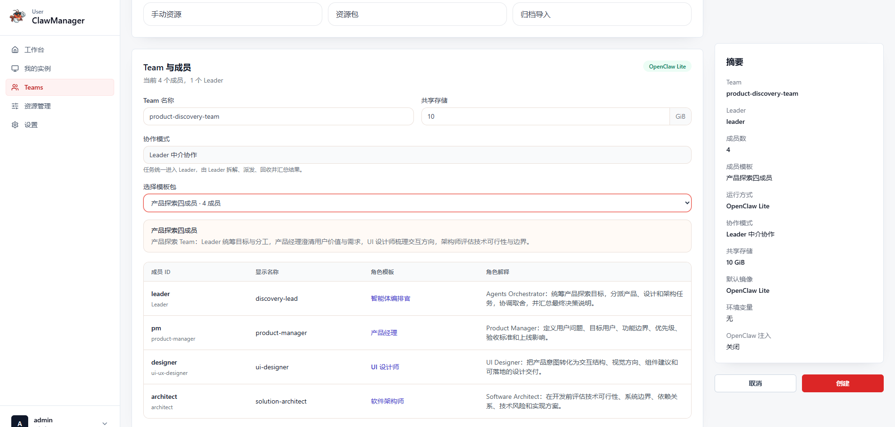
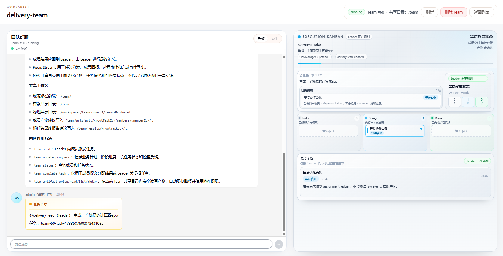

# Team Workspace Quick Guide

Team은 여러 OpenClaw Lite 멤버가 하나의 공통 목표를 위해 협업하게 합니다. 역할 템플릿을 선택하고 Team을 만든 다음 Team 채팅에서 Leader에게 목표를 설명하면 됩니다. Leader가 계획 수립, 배정, 조율, 산출물 수집, 최종 결과 정리를 담당합니다.

## 적용 범위

- Team은 현재 **OpenClaw Lite** 모드로 실행됩니다.
- 협업 방식은 **Leader 중개 협업**으로 고정됩니다. 작업은 먼저 Leader에게 전달되고 Leader가 멤버를 조율합니다.
- 템플릿에는 멤버 역할이 이미 정의되어 있습니다. 일반적으로 멤버별 Runtime, 리소스 프리셋 또는 협업 설정을 따로 구성할 필요가 없습니다.

## 1. Team 만들기

1. 탐색 메뉴에서 **Teams**를 열고 Team 만들기를 선택합니다.
2. Team 이름을 입력하고 필요하면 공유 스토리지 용량을 조정합니다.
3. 멤버 템플릿을 선택하고 요약에서 Leader, 멤버 수, Runtime을 확인합니다.
4. **만들기**를 선택합니다.

생성 화면은 OpenClaw Lite와 Leader 중개 협업을 고정으로 사용합니다. 템플릿이 멤버 역할을 정하므로 개별 리소스 프리셋은 필요하지 않습니다.

## 2. 협업 시작하기

Team 상세 페이지를 열고 Team 채팅에서 Leader에게 업무 목표를 설명합니다. 예: “간단한 계산기 앱을 만들어 주세요.”

Leader는 계획을 만들고, 멤버를 배정하며, 산출물과 검토 근거를 수집한 뒤 최종 종합 결과를 게시합니다. 같은 작업을 각 멤버에게 직접 보낼 필요가 없습니다.

## 3. 진행 상황 확인하기

Team 상세 페이지에는 두 가지 주요 영역이 있습니다.

- **Team 채팅**: 계획, 배정, 의미 있는 진행, 산출물, 검토, Leader 종합을 보여 줍니다.
- **Execution Kanban**: 루트 작업 상태, 대기 중인 작업, 진행 중인 작업, 완료된 산출물을 보여 줍니다.

“Leader 계획 중”, “멤버 산출물 대기”, “Leader 종합 대기” 같은 상태는 현재 협업 단계를 뜻합니다. 같은 작업을 다시 보내지 말고, 목표나 승인 기준이 바뀌면 채팅에 후속 요구 사항을 남기세요.

## 4. 산출물 보기

멤버는 산출물과 검증 결론을 Leader에게 반환합니다. 최종 종합 결과는 Team 채팅과 작업 상세에 표시됩니다. 상세 페이지 상단의 **Files** 탭에서 공유 Team 산출물을 살펴볼 수 있습니다.

## 5. 템플릿 선택하기

- **Standard Two-Member Team**: Leader가 한 명의 실행 멤버를 조율하는 집중 작업에 적합합니다.
- **Delivery Three-Member Team**: 소규모 납품을 위한 구현과 검토에 적합합니다.
- **Product Discovery Four-Member Team**: 제품, 디자인, 기술 실현 가능성 탐색에 적합합니다.
- **Software Engineering Eight-Member Team**: 제품, 디자인, 프론트엔드, 백엔드, 아키텍처, QA, 코드 리뷰를 포함한 개발 작업에 적합합니다.

템플릿은 시작점입니다. 가장 가까운 템플릿을 선택한 뒤 범위, 제약 조건, 승인 기준을 Team 채팅에 추가하세요.
